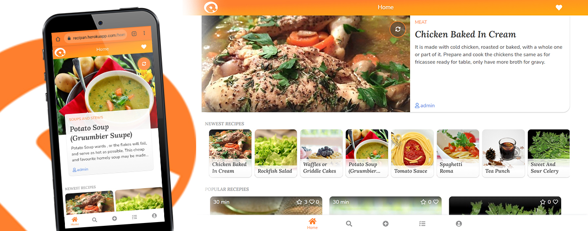

# reciPan - a recipe managment app (MeteorJS)

### See it live [reciPan app](https://recipan.herokuapp.com/)
-------------
Notice! First start delay is about 20 seconds because of Heroku hosting cold start on the free packet.

### About
-------------
- built with Meteor, using Blaze linrary on the front end
- recipes creation (private or public) and editing
- view recipes created by other users
- search recipes by category, name and ingridients
- recipes sharing
- list of favorites
- shopping list
- social network features (adding friends and sharing recipes with friends)
